# Overview of the analysis: Explain the purpose of this analysis

In this project I am applying  machine learning to solve a real-world challenge: credit card risk. 

Credit risk is an inherently unbalanced classification problem, as good loans easily outnumber risky loans. Therefore, I will be employing
different techniques to train and evaluate models with unbalanced classes. I am using imbalanced-learn and scikit-learn libraries to build 
and evaluate models using resampling.

Using the credit card credit dataset from LendingClub, a peer-to-peer lending services company, i have oversampled the data using the 
RandomOverSampler and SMOTE algorithms, and undersampled the data using the ClusterCentroids algorithm. Then, a combinatorial 
approach of over- and undersampling has been done using the SMOTEENN algorithm. Two new machine learning models have been compared that 
reduce bias, BalancedRandomForestClassifier and EasyEnsembleClassifier, to predict credit risk. 

# Results

## RandomOverSampler Model

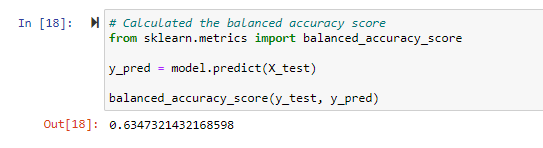

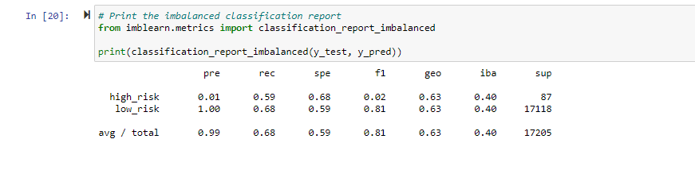

- The balanced accuracy score is 63% which is not a good one
- The high risk precision is 1% and sensitivy 59% 
- The F-score average 81% and 2% for the high_risk prediction

## SMOTE Oversampling Model

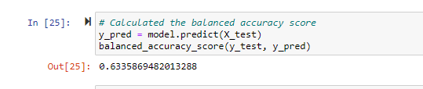

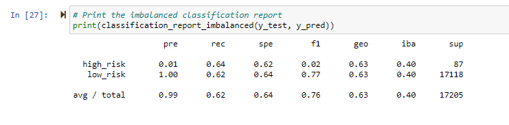

- The balanced accuracy score is again 63% as the RandomOverSampler Model
- The high risk precision is 1% and sensitivy 64% 
- The F-score average 76% and 2% for the high_risk prediction

## ClusterCentroids Model

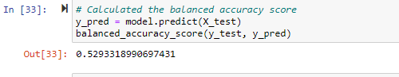

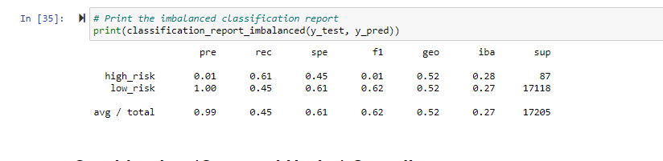

- The balanced accuracy score is again 53% 
- The high risk precision is 1% and sensitivy 61% 
- The F-score average 62% and 1% for the high_risk prediction

## SMOTEENN Model

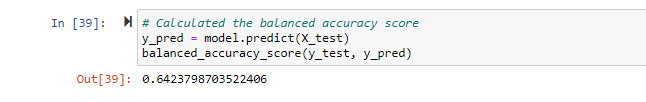

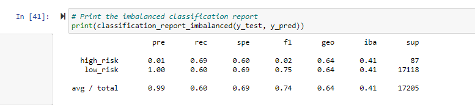

- The balanced accuracy score is again 64% 
- The high risk precision is 1% and sensitivy 69% 
- The F-score average 74% and 2% for the high_risk prediction

## Balanced Random Forest Classifier

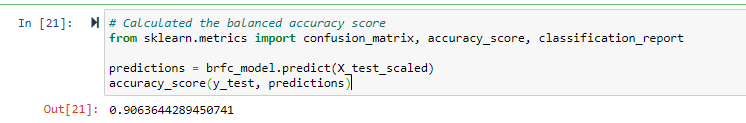

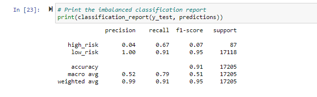

- The balanced accuracy score is again 91% 
- The high risk precision is 4% and sensitivy 67%
- The F-score average 95% and 7% for the high_risk prediction 

## Easy Ensemble AdaBoost Classifier

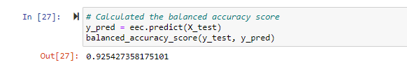

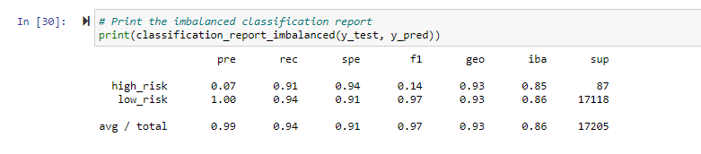

- The balanced accuracy score is again 93% 
- The high risk precision is 7% and sensitivy 91% 
- The F-score average 97% and 14% for the high_risk prediction 

# Summary

- All the machine learning models used to perform the credit risk analysis fail in accurately determining the credit risk
- Out of all the models, the Ensemble model has the highest accuracy. However, the high_risk prediction is only 7% which is very low.
  The F-score is also 14% for the high risk prediction which again is not a good one.
- It would be very risky to use any of the above models to evaluate the credit risk. So, in my recomendation, none of the above models 
  should be used. 

